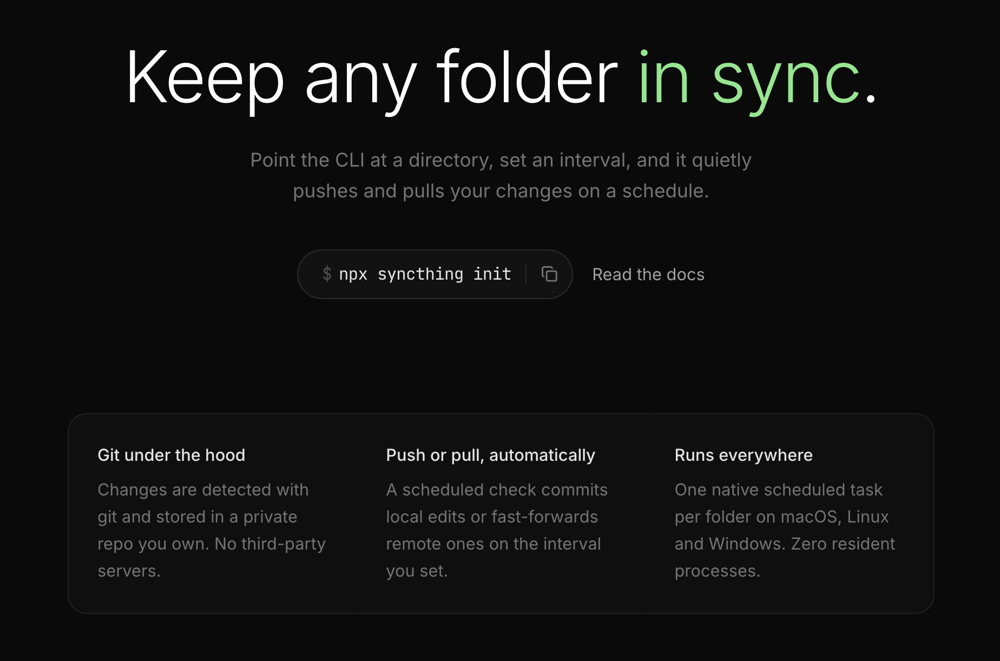

# syncthng

## Commands

- `syncthng init` — set up a new directory to sync
- `syncthng connect [owner/repo] [directory]` — connect this machine to an existing sync
- `syncthng sync [name]` — sync now (used by the scheduler); omit name to sync all
- `syncthng list` — list configured directories
- `syncthng status` — show live git state for each directory
- `syncthng remove [name]` — stop syncing a directory (files are kept)
- `syncthng service repair` — re-register all scheduled tasks
- `syncthng service uninstall` — remove all scheduled tasks
